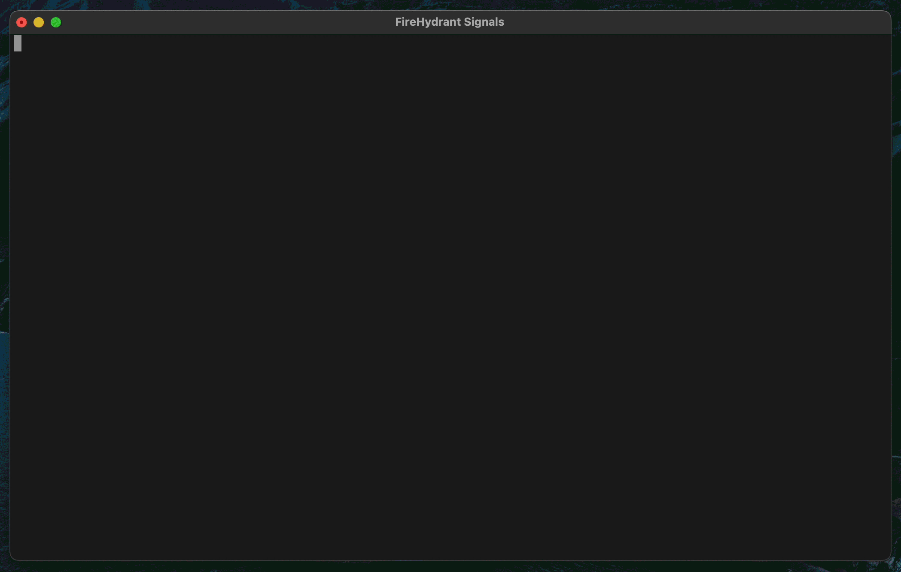

# Signals Migrator

This can be used to import resources from legacy alerting providers into Signals.



## Usage

[Download the binary from GitHub releases](https://github.com/firehydrant/signals-migrator/releases), or if you prefer using Go toolchain, run:

```shell
go install github.com/firehydrant/signals-migrator@latest
```

### Generate Signals resources from external alerting providers

Ensure these environment variables are set:

- `FIREHYDRANT_API_KEY` (retrieve this from [FireHydrant Settings > API Keys](https://docs.firehydrant.com/docs/api-keys))
- `PROVIDER` e.g. 'PagerDuty'
- `PROVIDER_API_KEY`
- `PROVIDER_APP_ID` (optional, not all providers require this)

Afterwards, run `signals-migrator import` (or `go run . import` for development version), which will generate `output/[PROVIDER]_to_fh_signals.tf` file.

During the process, we will attempt to match users by email to existing users in FireHydrant. For users without a match, we will ask you to decide on whether to skip the user or manually match them to existing user.

> [!IMPORTANT]
> If you are using Single Sign-On (SSO) for FireHydrant, we recommend using SCIM provisioning before running this tool to ensure users are correctly set up.

On the other hand, we can't reliably match teams ourselves as they have wide variance of identification. As such, we will ask you to select from three options:

1. Skip the team
1. Create a new team
1. Match to an existing team

Afterwards, the tool will generate the mapping appropriately, handling de-duplication and merging as necessary.

## Supported providers

We support importing from various providers. Refer to individual documentation for provider-specific instructions:

| | PagerDuty | Opsgenie | VictorOps |
| --- | --- | --- | --- |
| Docs | [PagerDuty](./docs/pagerduty.md) | [Opsgenie](./docs/opsgenie.md) | [VictorOps](./docs/victorops.md) |
| Import users | :white_check_mark: | :white_check_mark: | :white_check_mark: |
| Import teams and members | :white_check_mark: | :white_check_mark: | :white_check_mark: |
| Import escalation policies | :white_check_mark: | :white_check_mark: | :x: |
| Import scheduling strategy | :white_check_mark: | :white_check_mark: | :x: |

## Provider Notes

### OpsGenie
- When creating schedules or rotations with a custom strategy, a start time must be added.  We will attempt to add this based on the start time provided to us by Opsgenie, but this will fail to apply if that date is more than 30 days in the past.  If that happens, choose an appropriate start time less than 30 days in the past and update the terraform accordingly before applying
- When creating multiple escalation policies for a team, one of them should be selected as the default before applying.  To do so, update the `default = "false"` line at the end of the escalation policy resource definition in the terraform file before applying. 

## Developing

A devcontainer setup has been prepared to be used in VS Code. Run `direnv allow` to auto-load `.env` file.

If alternative method is preferred, you will need:

- Go compiler
- Install tools in `./deps.sh`

Also recommended to smooth out development outside of devcontainer:

- [direnv](https://direnv.net/) for autoloading `.env` file, also automatically adds `./bin` to `$PATH`.
- [just](https://just.systems/) for running tasks defined in `Justfile`.

Most commands in `Justfile` can be run out in regular bash too.
